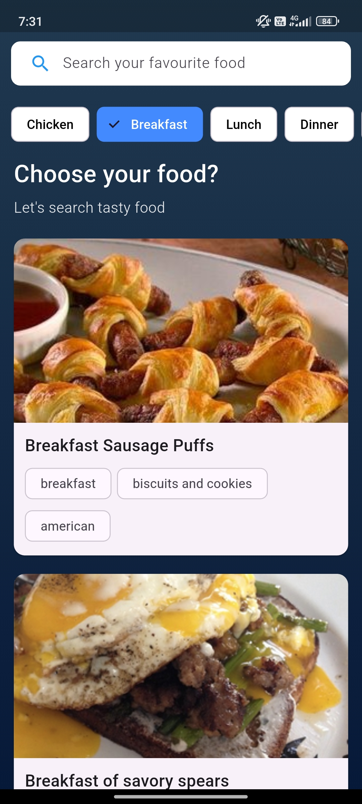

# 🍲 Recipe Hub – Flutter Recipe App

A modern recipe browsing application built using Flutter with REST API integration.  
Users can search recipes, filter by category, and view detailed ingredients & nutrition information.

---

## 📸 Screenshots

  
  
  

---

## 🚀 Key Features

- 🔍 Search recipes by name
- 🏷️ Category filters (Breakfast, Lunch, Dinner, etc.)
- 📊 Calories & servings information
- 🧾 Detailed ingredients list
- 🌐 API-based dynamic data
- 🎨 Clean gradient UI
- 📱 Responsive design

---

## 🛠️ Tech Stack

- Flutter
- Dart
- REST API Integration
- HTTP Package
- JSON Parsing
- Stateful Widgets
- Clean UI Architecture

---

## ▶️ Installation

1. Clone the repository
